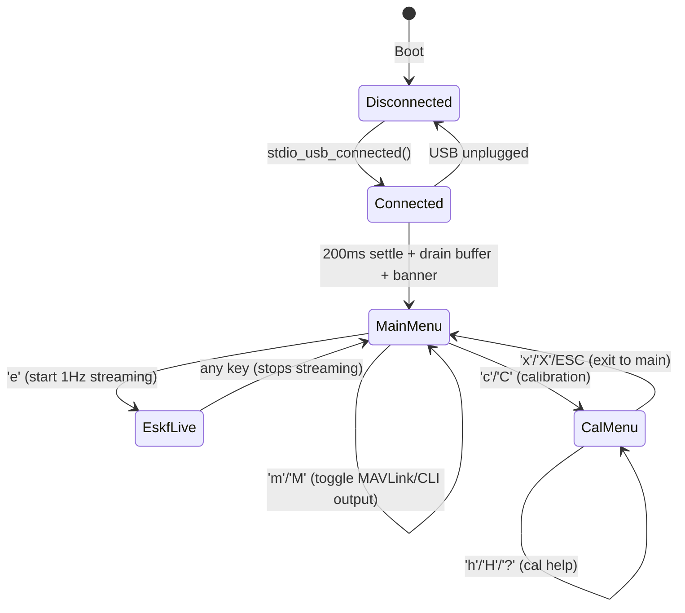
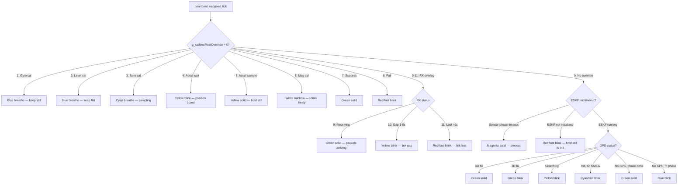

# Runtime Behavior Map (RBM)

**Date:** 2026-03-08
**Firmware:** Stage 7 complete (commit c00c573)
**Diagrams:** Graphviz `.dot` sources in `docs/audits/cla_rbm/dot/` — render with `dot -Tsvg <file>.dot -o <file>.svg`

---

## 1. Overview

This document maps all runtime execution paths, state machines, cross-core interactions, and error recovery flows in the RocketChip firmware. It serves as a reference for understanding the system before adding Stage 8 (Flight Director) complexity.

**Conventions:**
- Graphviz `.dot` diagrams for complex state/flow diagrams (boot, error recovery, cross-core)
- Mermaid for simple state machines (CLI, NeoPixel)
- Indented call trees for function-level breakdown
- CLA timing values annotated where applicable (see `COMPUTATIONAL_LOAD_ANALYSIS.md`)

---

## 2. Happy-Path Timing Diagram

A single normal iteration on each core when nothing goes wrong.

### Core 0: 5ms tick (200Hz ESKF epoch)

```
|<------------- 5,000 µs (200Hz) ------------->|
|                                               |
| heartbeat  |  wdt  | eskf_tick    |log|rad|cli| sleep_ms(1) |
| <1µs       | <1µs  | 577µs avg   |10 |20 |5  | ~4,380µs    |
|             |       | (108-802µs) |   |   |   | (idle)      |
```

- **eskf_tick()** dominates: codegen FPFT predict (108µs) + UD factorize/reconstruct (~470µs) + measurement updates (baro 43µs, mag 43µs, ZUPT 43µs)
- All other ticks combined: <50µs typical
- **~88% idle** per epoch — substantial headroom

### Core 1: 1ms tick (1kHz sensor cycle)

```
|<------- 1,000 µs (1kHz) ------->|
|                                   |
| IMU read     | seqlock | neo | pad |
| 774µs avg    | <5µs    | <10 | ~200µs busy_wait |
|              |         |     |     |
| + baro (251µs every 62 cycles)   |
| + GPS  (~50µs every 100 cycles)  |
| + mag  (~100µs every 10 cycles)  |
```

- **IMU read dominates** at 77.4% of cycle budget
- Baro/GPS/mag add occasional spikes (see CLA Section 4.2)
- `busy_wait_us()` padding absorbs timing variance

---

## 2b. Concurrency Timeline

System lifecycle phases with both cores:

```
Phase         Core 0                          Core 1
────────────  ─────────────────────────────   ─────────────────────
BOOT          init_hardware()
                fault handlers + MPU guard
                NeoPixel init
                psram_init() + self_test()
                multicore_launch_core1() ───> core1_entry()
                                              MPU stack guard (Core 1)
                i2c_bus_init()                wait for g_startSensorPhase...
                init_sensors() (probe-first)  (waiting)
                init_peripherals()            (waiting)
                  SPI + radio init
                  telemetry + MAVLink init
                  cal storage init
                  stdio_init_all() (USB)
              init_application()
                init_rc_os_hooks()
                g_startSensorPhase=true ────> wait loop unblocks
                                              multicore_lockout_victim_init()
                wait g_core1LockoutReady <─── g_core1LockoutReady=true
                psram flash-safe test
                logging ring + flight table
                watchdog_enable(5s)

SENSOR PHASE  Main loop:                     core1_sensor_loop():
              heartbeat_tick()               IMU read (1kHz)
              watchdog_kick_tick()            Baro read (16Hz)
              eskf_tick() ←── seqlock ──────  GPS read (10Hz)
              logging_tick()                  Mag read (100Hz)
              telemetry_radio_tick()          seqlock_write()
              mavlink_direct_tick()           NeoPixel update
              cli_update_tick()              g_wdtCore1Alive=true
              sleep_ms(1)                    busy_wait(remaining)

CALIBRATION   g_core1PauseI2C=true ────────> stalls, LED orange
(rare, CLI)   wait g_core1I2CPaused          g_core1I2CPaused=true
              icm20948_set_i2c_master(false)  (waiting)
              ... calibration reads ...
              g_core1PauseI2C=false ────────> resumes, LED blue
              g_calReloadPending=true ──────> reloads cal from flash

FLASH OPS     flash_safe_execute() ─────────> multicore_lockout
(rare)        (erase/write, 1-150ms)          (Core 1 stalled)
              i2c_bus_reset() after ─────────> resume, bus recovered
```

---

## 3. Boot Sequence

See `dot/boot_sequence.dot` for visual diagram.

```
main()
├── init_hardware()  [returns bool: watchdog_reboot]
│   ├── check_watchdog_reboot()              [Sentinel in scratch[0] == 0x52435754]
│   │   └── If true: g_watchdogReboot = true, clear sentinel
│   ├── init_early_hw()
│   │   ├── exception_set_exclusive_handler(HARDFAULT)  [Fault handlers first]
│   │   ├── exception_set_exclusive_handler(MEMMANAGE)
│   │   ├── mpu_setup_stack_guard(Core 0)    [MPU stack guard]
│   │   ├── gpio_init(LED_PIN) + gpio_set_dir(OUTPUT)
│   │   └── ws2812_status_init(pio0, NEOPIXEL_PIN, count)
│   ├── psram_init() + psram_self_test()     [Before Core 1 — QMI XIP interaction]
│   ├── multicore_launch_core1(core1_entry)  [Core 1 starts early, waits for signal]
│   ├── i2c_bus_init()                       [I2C1, 400kHz — after flash ops]
│   ├── init_sensors()                       [Probe-first detection]
│   │   ├── sleep_ms(200)                    [Sensor power-up settling]
│   │   ├── i2c_bus_probe(0x69) → icm20948_init()  [IMU]
│   │   │   └── icm20948_enable_bypass()     [Mag direct access at 0x0C]
│   │   ├── i2c_bus_probe(0x77) → baro_dps310_init() + start_continuous()  [Baro]
│   │   ├── UART GPS detect → gps_uart_init()  [Preferred if board::kUartGpsAvailable]
│   │   └── I2C GPS fallback → i2c_bus_probe(0x10) → gps_pa1010d_init()
│   └── init_peripherals()
│       ├── spi_bus_init()                   [SPI0 for radio]
│       ├── rfm95w_init(&g_radio, ...)       [LoRa radio, if SPI OK]
│       ├── telemetry_service_init()         [TX or RX per Mission Profile]
│       ├── MAVLink encoder init
│       ├── calibration_storage_init()       [Flash — reads cal data]
│       └── init_usb() → stdio_init_all()    [USB CDC — AFTER flash ops]
│
├── init_application(watchdogReboot)
│   ├── init_rc_os_hooks()                   [Wire CLI callbacks]
│   ├── g_startSensorPhase = true            [Signal Core 1 to start sensor loop]
│   ├── rc_os_i2c_scan_allowed = false       [Core 1 owns I2C now]
│   ├── Wait for g_core1LockoutReady         [Spin until Core 1 ready for lockout]
│   ├── psram_flash_safe_test()              [Deferred — needs lockout ready]
│   ├── init_logging_ring()                  [PSRAM or SRAM fallback]
│   ├── flight_table_load()                  [Load flight table from flash]
│   ├── calibration_start_baro()             [Auto baro ground ref, if baro present]
│   └── watchdog sentinel + watchdog_enable(5000)
│
└── while(true)  [Main loop — see Section 4]
```

### Init Order Constraints

| Order Rule | Reason | Source |
|------------|--------|--------|
| Flash ops before USB | Flash makes all flash inaccessible including USB IRQs | LL Entry 4, 12 |
| I2C init after flash | flash_safe_execute corrupts I2C peripheral | LL Entry 31 |
| PSRAM before Core 1 | QMI XIP interaction requires single-core init | Architecture |
| Sensor probe before init | Prevents bus side-effects from absent devices | LL Entry 28 |
| Core 1 launch early, signal late | Core 1 waits for g_startSensorPhase; init_application signals after setup | Architecture |
| Watchdog after Core 1 lockout ready | Both cores must be running before timeout starts | Architecture |

---

## 4. Core 0 Main Loop Dispatch

```
while (true) {
    nowMs = to_ms_since_boot()

    heartbeat_tick(nowMs)           // 1Hz: blink LED
    ├── Toggle LED every 500ms
    └── Uptime tracking

    watchdog_kick_tick()            // 1Hz: dual-core AND watchdog
    ├── Check g_wdtCore0Alive AND g_wdtCore1Alive
    ├── If both: watchdog_update(), clear flags
    └── If either missing: no kick → 5s timeout → reboot

    eskf_tick()                     // 200Hz: sensor fusion
    ├── seqlock_read() → snap
    ├── Check IMU epoch (every kEskfImuDivider samples)
    ├── predict(accel, gyro, dt)    [577µs avg — CLA measured]
    ├── eskf_tick_baro()            [when new baro data → update_baro()]
    ├── eskf_tick_mag()             [when new mag data → update_mag_heading(), gated]
    ├── update_zupt()               [when stationary detected]
    ├── eskf_tick_gps()             [when GPS fix → update_gps_position/velocity]
    │   └── eskf_tick_gps_stats()   [gate counters and fix tracking]
    ├── eskf_tick_mahony()          [AHRS cross-check, Mdiv computation]
    └── Health check → reset if unhealthy (CR-1 path)

    logging_tick()                  // 50Hz: data logging pipeline
    ├── Check ESKF epoch advanced
    ├── log_decimator_feed()        [50Hz or 25Hz depending on PSRAM]
    ├── pcm_frame_encode()          [if decimator fires]
    └── ring_push()                 [to SRAM or PSRAM ring buffer]

    telemetry_radio_tick(nowMs)     // 2-10Hz: LoRa TX or RX
    ├── TX mode: CCSDS encode → rfm95w_send()
    ├── RX mode: rfm95w_receive() → CCSDS decode → MAVLink re-encode
    └── RX NeoPixel overlay (green/yellow/red by gap time)

    mavlink_direct_tick(nowMs)      // 1-10Hz: USB MAVLink output
    ├── 1Hz: heartbeat + sys_status via fwrite(stdout)
    └── 10Hz: attitude + global_pos via fwrite(stdout)

    cli_update_tick()               // 20Hz: CLI processing
    └── rc_os_update() → key dispatch (see Section 6)

    sleep_ms(1)                     // Yield ~1ms
}
```

---

## 5. Core 1 Sensor Loop

```
core1_entry()
├── mpu_setup_stack_guard(__StackOneBottom)
├── Wait for g_startSensorPhase (spin on atomic)
├── multicore_lockout_victim_init()
├── g_core1LockoutReady = true
└── core1_sensor_loop()

core1_sensor_loop()
├── core1_load_cal_or_defaults(&localCal)
└── while (true)  [1kHz target]
    ├── cycleStartUs = time_us_32()
    ├── core1_check_pause_and_reload(&localCal)  [cal pause handshake]
    │   ├── If g_core1PauseI2C: stall, LED orange, wait for release
    │   └── If g_calReloadPending: reload cal from flash
    ├── core1_read_imu(&localData, &localCal, &imuConsecFail, feedCal)
    │   ├── icm20948_read() → raw data
    │   ├── Validate |A| >= 3.0 m/s² (zero-output fault detection)
    │   ├── core1_apply_imu_cal() — apply calibration (offset, scale, rotation)
    │   ├── On failure: core1_imu_error_recovery()
    │   │   ├── >= 10 (every 10th): i2c_bus_recover()
    │   │   └── >= 50: icm20948_init() (full device reinit)
    │   └── On success: imuConsecFail = 0
    ├── core1_read_baro(&localData)  [every kCore1BaroDivider cycles]
    │   ├── baro_dps310_read() → pressure, temperature
    │   └── On failure: error_count++ (no recovery mechanism)
    ├── core1_read_gps(&localData, &lastGpsReadUs)  [every kCore1GpsDivider cycles]
    │   ├── g_gpsFnUpdate() → parse NMEA
    │   ├── core1_update_best_gps_fix() — track best fix type for status display
    │   ├── 500µs settling delay (PA1010D I2C bus contention fix)
    │   └── On failure: error_count++
    ├── Mag read via IMU bypass [every kCore1MagDivider cycles]
    ├── seqlock_write(&g_sensorSeqlock, &localData)
    ├── g_wdtCore1Alive = true
    ├── core1_neopixel_update() (see Section 7)
    ├── elapsed = time_us_32() - cycleStartUs
    └── busy_wait_us(1000 - elapsed)  [pad to 1ms target]
```

---

## 6. CLI State Machine



### Key Binding Summary

**Main Menu** (handled in `rc_os.cpp:handle_main_menu()` + `main.cpp:handle_unhandled_key()`):

| Key | Action | Handler |
|-----|--------|---------|
| `h`, `H`, `?` | Print help / system status | rc_os.cpp |
| `s`, `S` | Print sensor status (one-shot) | rc_os.cpp → callback |
| `e` | Start ESKF live streaming (1Hz) | rc_os.cpp → callback |
| `b`, `B` | Reprint boot summary | rc_os.cpp → callback |
| `i`, `I` | I2C bus scan (guarded: disabled when Core 1 owns bus) | rc_os.cpp |
| `c`, `C` | Enter calibration submenu | rc_os.cpp |
| `l`, `L` | Flush log ring buffer to flash | main.cpp |
| `f`, `F` | List stored flights | main.cpp |
| `d`, `D` | Download flight (binary + CRC) | main.cpp |
| `x`, `X` | Erase all flights (requires "YES" confirm) | main.cpp |
| `t`, `T` | Radio status (TX or RX stats) | main.cpp |
| `r` | Cycle TX rate (2/5/10 Hz, TX mode only) | main.cpp |
| `m`, `M` | Toggle MAVLink/CLI output mode | main.cpp |

**Calibration Menu** (handled in `rc_os.cpp:handle_calibration_menu()`):

| Key | Action |
|-----|--------|
| `g`, `G` | Gyro calibration |
| `l`, `L` | Level calibration |
| `b`, `B` | Baro calibration |
| `a`, `A` | 6-position accel calibration |
| `m`, `M` | Compass (mag) calibration |
| `w`, `W` | Full wizard (all cals in sequence) |
| `v`, `V` | Save calibration to flash |
| `r`, `R` | Reset all calibration |
| `x`, `X`, ESC | Exit to main menu |
| `h`, `H`, `?` | Reprint cal menu help |

**ESKF Live** — any key stops streaming and returns to main menu.

**Command Functions** (main.cpp, dispatched via `handle_unhandled_key()`):
- `cmd_flush_log()` — flush logging ring buffer to flash
- `cmd_erase_all_flights()` — erase all stored flights (requires "YES" confirmation)
- `cmd_list_flights()` — list stored flight table
- `cmd_download_flight()` — download flight data (binary + CRC)
- `cmd_radio_status()` — print radio TX/RX statistics

---

## 7. NeoPixel Priority Hierarchy

NeoPixel state is decided in `heartbeat_neopixel_tick()` (Core 0) using `neo_set_if_changed()` to preserve animation phase. The `g_calNeoPixelOverride` atomic (written by Core 0 CLI, read by Core 1) provides override control. Highest priority wins:



### NeoPixel Modes (ws2812_status.h)

| Mode | Pattern | Period | Meaning |
|------|---------|--------|---------|
| `WS2812_MODE_OFF` | LED off | — | Inactive |
| `WS2812_MODE_SOLID` | Constant color | — | Steady state |
| `WS2812_MODE_BREATHE` | Smooth brightness pulse | 2000ms | Calibration in progress |
| `WS2812_MODE_BLINK` | On/off toggle | 500+500ms | Attention/searching |
| `WS2812_MODE_BLINK_FAST` | On/off toggle | 100+100ms (5Hz) | Error/warning |
| `WS2812_MODE_RAINBOW` | Smooth hue cycle | 6000ms | Mag cal (rotate freely) |

### Calibration Override Codes (`g_calNeoPixelOverride`)

| Code | Name | Color | Mode | Context |
|------|------|-------|------|---------|
| 0 | `kCalNeoOff` | — | — | No override (fall through to status) |
| 1 | `kCalNeoGyro` | Blue | Breathe | Gyro cal (keep still) |
| 2 | `kCalNeoLevel` | Blue | Breathe | Level cal (keep flat) |
| 3 | `kCalNeoBaro` | Cyan | Breathe | Baro cal (sampling) |
| 4 | `kCalNeoAccelWait` | Yellow | Blink | Accel cal — position board |
| 5 | `kCalNeoAccelSample` | Yellow | Solid | Accel cal — hold still |
| 6 | `kCalNeoMag` | White | Rainbow | Mag cal — rotate freely |
| 7 | `kCalNeoSuccess` | Green | Solid | Calibration step passed |
| 8 | `kCalNeoFail` | Red | Fast blink | Calibration step failed |
| 9 | `kRxNeoReceiving` | Green | Solid | RX: packets arriving (gap < 1s) |
| 10 | `kRxNeoGap` | Yellow | Blink | RX: link gap (1-5s) |
| 11 | `kRxNeoLost` | Red | Fast blink | RX: link lost (>5s gap) |

---

## 8. Error Recovery Paths

See `dot/error_recovery.dot` for visual diagram.

Each path terminates in one of three outcomes:
- **(a) Recovered** — normal operation resumed
- **(b) Degraded** — running with reduced capability (documented below)
- **(c) Watchdog Reset** — full reboot

### 8.1 IMU (ICM-20948)

| Trigger | Action | Outcome |
|---------|--------|---------|
| I2C NACK | imuConsecFail++, mark accel/gyro invalid | Retry next cycle |
| 10+ consecutive fails (every 10th) | i2c_bus_recover() (9-clock recovery) | **(a)** Recovered |
| 50+ consecutive fails | icm20948_init() (full device reinit + bypass mode) | **(a)** Recovered |
| Zero-output fault (\|A\| < 3.0 m/s²) | Routes to consecutive fail path (same escalation) | **(a)** Recovered |
| Sustained failure | No ESKF predict, filter coasts | **(b)** Loss: attitude/position/velocity |

Constants: `kCore1ConsecFailBusRecover = 10`, `kCore1ConsecFailDevReset = 50`, `kAccelMinHealthyMag = 3.0f`

### 8.2 Baro (DPS310)

| Trigger | Action | Outcome |
|---------|--------|---------|
| Read failure (MEAS_CFG not ready) | error_count++ | Retry next cycle |
| Sustained read failure | No baro altitude updates | **(b)** Loss: barometric altitude. GPS+ZUPT fallback |
| **KNOWN GAP:** No re-init of continuous mode | — | Baro can freeze permanently until reboot |

### 8.3 GPS (PA1010D / UART)

| Trigger | Action | Outcome |
|---------|--------|---------|
| NMEA parse failure | error_count++, skip cycle | **(a)** Recovered on next valid sentence |
| No satellite fix | GPS data marked invalid | **(b)** Loss: position/velocity updates. Dead-reckoning only |
| UART RX overflow | Bytes dropped, rxOvf counter | **(a)** Self-correcting (ring buffer) |

### 8.4 ESKF Filter

5 health sentinels checked every predict cycle in `eskf.cpp:healthy()`:

| Trigger | Sentinel | Outcome |
|---------|----------|---------|
| NaN/Inf in P matrix | `!P.is_finite()` | **(a)** Filter reset via CR-1 path |
| Non-positive P diagonal (core states 0-14) | `P(i,i) <= 0` | **(a)** Filter reset |
| Quaternion norm drift | `|norm(q) - 1| > 1e-3` | **(a)** Filter reset |
| Implausible biases | Gyro bias > 0.175 rad/s or accel bias > 1.0 m/s² | **(a)** Filter reset |
| Velocity divergence (LL Entry 29) | `v.norm() >= 500 m/s` | **(a)** Filter reset |
| Sustained sensor failure | No measurement updates available | **(b)** Loss: nav solution. NeoPixel = UNHEALTHY |

**CR-1 path:** `g_eskfInitialized = false` → next cycle calls `eskf_try_init()` → waits for IMU stationarity → reinitializes. **No forced reset timer** — if filter diverges slowly (below 500 m/s), it can persist until watchdog fires.

### 8.5 Watchdog

| Trigger | Action | Outcome |
|---------|--------|---------|
| Core 0 or Core 1 stalled >5s | Watchdog timeout | **(c)** Full reboot |
| Post-reboot: scratch sentinel | Warning printed, sentinel cleared | Continue normally |

### 8.6 USB CDC

| Trigger | Action | Outcome |
|---------|--------|---------|
| Terminal disconnects | CLI stops processing, LED slow blink | **(a)** No impact on sensors/ESKF |
| Terminal connects | Drain buffer, print banner | **(a)** CLI available |

### 8.7 Flash Operations

| Trigger | Action | Outcome |
|---------|--------|---------|
| flash_safe_execute() | Core 1 stalled via multicore_lockout | **(a)** i2c_bus_reset() after, Core 1 resumes |
| Flash sector erase | ~150ms Core 1 stall | **(a)** Sensors resume after recovery |

### 8.8 I2C Bus

| Trigger | Action | Outcome |
|---------|--------|---------|
| SDA stuck LOW | i2c_bus_reset(): deinit → 9-clock → reinit | **(a)** Bus recovered |
| SCL stuck LOW | Early exit (can't pulse, another device holding) | **(b)** Bus unusable until power cycle |

---

## 9. Cross-Core Communication Map

See `dot/cross_core.dot` for visual diagram.

| Primitive | Type | Writer | Reader | Rate | Purpose |
|-----------|------|--------|--------|------|---------|
| `g_sensorSeqlock` | Seqlock (148B struct) | Core 1 | Core 0 | 1kHz write, 200Hz read | Sensor data transfer |
| `g_startSensorPhase` | atomic\<bool\> | Core 0 | Core 1 | Once at boot | Signal Core 1 to start |
| `g_core1LockoutReady` | atomic\<bool\> | Core 1 | Core 0 | Once at boot | Core 1 ready for flash lockout |
| `g_wdtCore0Alive` | atomic\<bool\> | Core 0 | Core 0 | 1kHz set, 1Hz check | Watchdog Core 0 liveness |
| `g_wdtCore1Alive` | atomic\<bool\> | Core 1 | Core 0 | 1kHz set, 1Hz check | Watchdog Core 1 liveness |
| `g_core1PauseI2C` | atomic\<bool\> | Core 0 | Core 1 | Rare (cal commands) | Pause Core 1 I2C for calibration |
| `g_core1I2CPaused` | atomic\<bool\> | Core 1 | Core 0 | Rare (cal commands) | Acknowledge pause |
| `g_calReloadPending` | atomic\<bool\> | Core 0 | Core 1 | Rare (cal commands) | Signal cal data reload |
| `g_calNeoPixelOverride` | atomic\<uint8_t\> | Core 0 | Core 1 | Rare (cal commands) | Override NeoPixel for cal feedback |
| `flash_safe_execute` | multicore_lockout | Core 0 | Core 1 stalled | Rare (flash ops) | Safe flash access |

---

## 10. Sensor Detection Permutations

`init_sensors()` uses probe-first detection. All combinations are valid:

| IMU | Baro | GPS | Behavior |
|-----|------|-----|----------|
| Yes | Yes | Yes (UART) | Full operation — all sensors + ESKF + telemetry |
| Yes | Yes | Yes (I2C) | Full operation — I2C GPS with 500µs settling delay |
| Yes | Yes | No | ESKF runs without GPS. No position/velocity from GPS. ZUPT + baro only |
| Yes | No | Yes | ESKF runs without baro. No altitude from baro. GPS altitude only |
| Yes | No | No | ESKF runs with IMU only. Attitude-only mode (drifts without aiding) |
| No | Yes | Yes | **ESKF does not run** (no IMU predict). Baro/GPS data collected but unused |
| No | Yes | No | Baro-only. No ESKF. Temperature and altitude only |
| No | No | Yes | GPS-only. No ESKF. Position/speed from GPS sentences |
| No | No | No | **Minimal mode.** LED heartbeat, CLI, radio (if present). No sensor data |

**Radio** is detected separately via SPI probe. Present/absent is orthogonal to sensor detection.

---

## 11. Blocking Code Paths

| Path | Core | Duration | Trigger | Watchdog Impact |
|------|------|----------|---------|-----------------|
| `flash_safe_execute` (erase) | Core 0 | ~150ms | Log flush, erase | Core 1 stalled |
| `flash_safe_execute` (write) | Core 0 | ~1-2ms | Log flush | Core 1 briefly stalled |
| `calibration_save()` | Core 0 | ~150ms | CLI cal command | Core 1 stalled |
| `i2c_bus_reset()` | Core 1 | ~1ms | After flash op or IMU fail | None |
| `icm20948_reinit()` | Core 1 | ~10ms | 10+ consecutive IMU fails | Misses ~10 sensor cycles |
| `core1_check_pause` stall | Core 1 | Unbounded (user-driven) | Calibration in progress | Cal must complete before 5s WDT |
| `sleep_ms(1)` | Core 0 | 1ms | Every main loop | None (kicked before) |
| `USB settle` | Core 0 | 200ms | Terminal connect | None |
| `read_flight_number()` | Core 0 | Unbounded (user input) | Flight download command | Must respond within 5s |

---

## 12. Identified Gaps and Dead Paths

### Known Gaps

| ID | Description | Impact | Recommended Fix |
|----|-------------|--------|-----------------|
| GAP-1 | DPS310 baro has no recovery mechanism for frozen continuous mode | Baro data stops, ESKF loses altitude | Re-check MEAS_CFG periodically, re-init if stopped |
| GAP-2 | Radio TX/RX has no timeout/retry logic | Lost packets silently dropped | Add retry counter, exponential backoff |
| GAP-3 | ESKF has no active reset command (only passive health check) | Cannot force filter reset from CLI | Add 'R' key to trigger manual ESKF reset |
| GAP-4 | `read_flight_number()` blocks Core 0 waiting for user input | Could trigger watchdog if user delays >5s | Add timeout or non-blocking input |
| GAP-5 | GPS UART has no peripheral reset if ISR stalls | Ring buffer helps but stuck ISR means no data | Add heartbeat timeout → UART deinit/reinit |
| GAP-6 | ESKF has no forced reset timer for slow divergence | If velocity drifts slowly (<500 m/s), filter persists until watchdog | Add timed reset after N seconds of unhealthy |

### Dead / Redundant Paths

| ID | Description | Status |
|----|-------------|--------|
| DEAD-1 | `g_sensorPhaseDone` is declared but never read | Can be removed |
| DEAD-2 | `g_bestGpsValid` / `g_bestGps*` fields are set but only used in 's' output | Review if needed for Stage 8 |

---

## Appendix: Staleness Check

Run `python scripts/rbm_check.py` to verify this document is current with the codebase. The script checks:
1. Required function names still exist in source
2. All tick functions in main loop are documented here
3. CLI key bindings are all listed
4. New functions matching key patterns are flagged

Re-run after adding new tick functions, CLI commands, state transitions, or error recovery paths.
